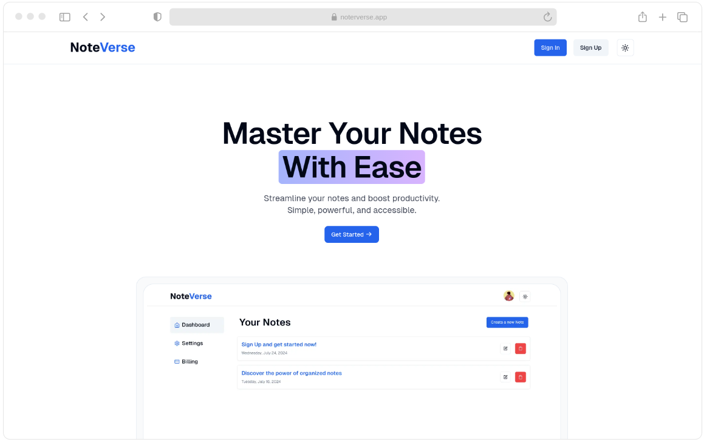

# 📝 Noteverse

Noteverse is a powerful note-taking SaaS application built with modern technologies, designed to help users easily create, edit, and manage their notes.





**[Visit Noteverse](https://noteverse-saas.vercel.app/)**


<br>

## 📚 Usage

To use Noteverse, simply follow these steps:

1. **Visit the App:**
   - Go to the live version of [Noteverse](https://noteverse-saas.vercel.app/).

2. **Sign Up / Log In:**
   - Create a new account or log in using your existing credentials via email or OAuth (Google or GitHub).

3. **Create a Note:**
   - Navigate to the Dashboard and click on 'Create Note' to create a new note.
   - Fill in the title and content, then save it.

4. **Manage Your Notes:**
   - View all your notes in the dashboard.
   - Edit or delete any existing notes as needed.

5. **Customize Your Experience:**
   - Toggle between light and dark themes for a comfortable viewing experience.
   - Adjust the color scheme in the settings to suit your preferences.

6. **Subscription Management:**
   - If you're on a paid plan, access the Stripe Customer Portal in the Settings to manage your subscription and billing details.

7. **Log Out:**
   - Remember to log out when you're finished to keep your account secure.


<br>


## 🚀 Features

- **Seamless Authentication:**
  - **🔐 Kinde Authentication** for passwordless login.
  - **🔑 OAuth Support** with Google and GitHub, giving users flexibility in sign-in methods.

- **Note Management:**
  - **📝 Full CRUD** (Create, Read, Update, Delete) functionality for notes.
  - **Edit and delete notes** with a user-friendly interface.

- **Customizable UI:**
  - **🎨 TailwindCSS** and **Shadcn UI** for modern, customizable design.
  - Easily change the **color scheme** to suit your preferences.

- **Database & Performance:**
  - **💿 Supabase Database** for secure, scalable data storage.
  - **💨 Prisma ORM** ensures smooth database operations.
  - **⚡ Cache Revalidation** for optimized performance through smart caching.

- **Subscription & Payment:**
  - **💵 Stripe Integration** for managing user subscriptions.
  - **🔄 Stripe Customer Portal** allows users to manage their billing details.
  - **💰 Seamless Stripe Checkout** for handling payments effortlessly.
  - **🪝 Stripe Webhooks** for real-time subscription and payment updates.

- **Deployment:**
  - **😶‍🌫️ Vercel Deployment** for fast and reliable performance, ensuring a smooth user experience.

<br>

## 📦 Technologies Used
- **Next.js** for the frontend.
- **TailwindCSS** and **Shadcn UI** for styling.
- **Kinde** for authentication.
- **Supabase** as the database backend.
- **Prisma ORM** for database queries.
- **Stripe** for payment processing.
- **Vercel** for deployment.

<br>

## 🏗️ Setup

To get a local copy of **Noteverse** up and running, follow these steps:

### Prerequisites

Make sure you have the following installed:

- [Node.js](https://nodejs.org/) (v16+)
- [npm](https://www.npmjs.com/) or [yarn](https://yarnpkg.com/)
- [Kinde](https://kinde.com/) authentication setup
- [Supabase](https://supabase.com/) project and keys
- [Stripe](https://stripe.com/) API keys

### Installation

1. Clone the repository:
   ```bash
   git clone https://github.com/your-username/noteverse.git

2. Navigate to the project folder:
    ```bash
    cd noteverse

3. Install dependencies:
    ```bash
    npm install

4. Set up environment variables:
    
    - You can use the provided .env.example file by copying it to .env.local:
      
    ```bash
    cp .env.example .env.local

5. Run the development server:
    ```bash
    npm run dev

6. Visit http://localhost:3000 to view the app.


<br>


## 🤝 Contributing
We welcome contributions to Noteverse! To get started:

1. Fork the repository.
2. Create a new branch (git checkout -b feature-branch).
3. Make your changes and commit them (git commit -m 'Add some feature').
4. Push the changes to your branch (git push origin feature-branch).
5. Create a pull request describing the changes you've made.
